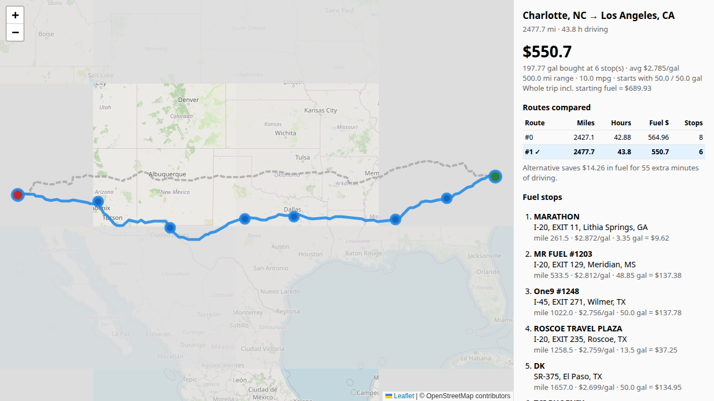

# Fuel Route API

A Django 6.1 REST API that takes a start and finish location in the USA and returns:

- the driving route (GeoJSON, plus an interactive HTML map),
- the most cost-effective fuel stops along it for a vehicle with a **500-mile range**,
- how many gallons to buy at each stop, and the **total fuel cost** at **10 MPG**.

The API compares all returned roads from one OSRM call and selects the lowest estimated operating cost: **whole-trip fuel + driving hours × $50 + stops × $5**. The driver/truck rate excludes fuel. An alternative must justify its extra driving and stop costs; there is no percentage time cutoff.

Each request makes **one** external routing call (the free OSRM API), and repeat trips make none. Inputs like `"City, ST"` are geocoded offline. In a 20-trip sample, OSRM averaged 374 ms and warm local road checks averaged about 5 ms per road. Full response time includes other work. See the [saved benchmark and capacity calculation](docs/benchmarks/REPORT.md).



## Quick start

```bash
python3.12 -m venv .venv && source .venv/bin/activate
pip install -r requirements.txt
cp .env.example .env
python manage.py migrate
python manage.py import_fuel_stations      # ~2 s, fully offline: loads + geocodes 6,626 US stations
python manage.py runserver
```

```bash
curl "http://127.0.0.1:8000/api/route/?start=New%20York,%20NY&finish=Los%20Angeles,%20CA"
open "http://127.0.0.1:8000/api/route/map/?start=New%20York,%20NY&finish=Los%20Angeles,%20CA"
```

To run the tests (313 tests, all offline because external APIs are mocked): `pytest`

You can also import `postman_collection.json` into Postman. It has the `base_url` variable already set. For recording, import `postman_demo_collection.json`: 11 numbered requests have literal localhost URLs, filled inputs and automated assertions, so you can click Send without editing. See [demo verification](docs/demo/README.md).

## API

### `GET /api/route/?start=…&finish=…` (or `POST /api/route/` with a JSON body)

| field | required | example |
|---|---|---|
| `start` | yes | `"Chicago, IL"`, `"Chicago, Illinois"`, `"41.88,-87.63"`, `"233 S Wacker Dr, Chicago"` |
| `finish` | yes | same formats |
| `start_fuel_gallons` | no | `20`. Fuel in the tank at departure, from 0 to 50. Defaults to a full tank (50 gal). |
| `start_fuel_price_per_gallon` | no | `3.25`. Finite nonnegative USD/gal; defaults to the lowest imported station price. |

Here is an abridged response from captured Charlotte → Los Angeles roads. The main road wins because the alternative's fuel savings do not cover its extra driving cost:

```json
{
  "route": {
    "route_index": 0,
    "distance_miles": 2427.1,
    "duration_hours": 42.88,
    "stations_considered": 291
  },
  "route_selection": {
    "rule": "Lowest whole-trip fuel cost + driving hours x $50/hour + $5/stop among feasible routes.",
    "reason": "The fastest route has the lowest total operating cost, including fuel, driving time and stops.",
    "routes_compared": 2,
    "options": [
      {
        "route_index": 0,
        "distance_miles": 2427.1,
        "duration_hours": 42.88,
        "extra_minutes_vs_fastest": 0,
        "fuel_cost": 569.91,
        "estimated_trip_fuel_cost": 704.28,
        "driving_cost": 2144.15,
        "stop_cost": 25.0,
        "total_operating_cost": 2873.43,
        "number_of_stops": 5,
        "error": null,
        "selected": true
      },
      {
        "route_index": 1,
        "distance_miles": 2477.7,
        "duration_hours": 43.8,
        "extra_minutes_vs_fastest": 55,
        "fuel_cost": 550.7,
        "estimated_trip_fuel_cost": 685.06,
        "driving_cost": 2190.15,
        "stop_cost": 30.0,
        "total_operating_cost": 2905.22,
        "number_of_stops": 6,
        "error": null,
        "selected": false
      }
    ]
  },
  "vehicle": {
    "range_miles": 500.0,
    "miles_per_gallon": 10.0,
    "tank_gallons": 50.0,
    "start_fuel_gallons": 50.0,
    "start_fuel_price_per_gallon": 2.68733,
    "start_fuel_price_source": "lowest_imported_station_price",
    "driver_truck_cost_per_hour": 50.0,
    "assumption": "Fuel is bought only at stations on the route; the vehicle arrives with as little fuel as possible."
  },
  "summary": {
    "number_of_stops": 5,
    "total_fuel_cost": 569.91,
    "total_gallons_purchased": 192.71,
    "total_gallons_used": 242.71,
    "gallons_used_from_start_tank": 50.0,
    "start_tank_fuel_value": 134.37,
    "estimated_trip_fuel_cost": 704.28,
    "estimated_driving_cost": 2144.15,
    "estimated_stop_cost": 25.0,
    "estimated_total_operating_cost": 2873.43,
    "average_price_paid": 2.957
  }
}
```

There are two ways to see the map:

- `map` is standard GeoJSON. You can paste it into [geojson.io](https://geojson.io) or drop it into Leaflet or Mapbox.
- `map_url` opens a ready-made Leaflet page. It shows the chosen route in blue, the alternatives as grey dashed lines, the stops, a route comparison table, and a cost breakdown. That page reuses the cached routes, so it makes no extra routing call.

The API returns these errors:

| Status | When |
|--------|------|
| 400 | Missing or invalid input (including starting gallons outside 0–50 or an invalid starting price), or a location that can't be found or is outside the USA |
| 422 | No drivable route exists (e.g. Hawaii → Boston), a stretch of more than 500 miles has no station, or the starting fuel can't reach the first station |
| 502 | Routing or geocoding service is unavailable, or returns malformed data |

## How it works

```
request ─► geocode start/finish ─► OSRM (1 call, cached) ─┬► route 0: snap stations ─► optimise ─┐
            offline gazetteer        fastest + alternatives  ├► route 1: snap stations ─► optimise ─┼► pick route ─► JSON / map
                                                             └► route 2: …                          ┘
```

1. **Station data.** `import_fuel_stations` reads the CSV and drops the Canadian rows. Some OPIS IDs appear more than once, so it keeps the cheapest price for each. The CSV has no coordinates, so it geocodes each station's city from the US Census gazetteer bundled in `data/us_places.csv.gz`. That covers about 97% of the cities. The remaining 135 small places were looked up once on Nominatim and committed to `data/station_geocode_overrides.json`, so imports are reproducible and offline.
2. **Geocoding inputs.** `"lat,lng"` is used as given, and `"City, ST"` (or a full state name) is resolved from the same offline gazetteer. Only free-form addresses go to Nominatim, and those results are cached.
3. **Routing.** One request uses `overview=full&alternatives=3`, asking for up to **three alternatives plus the main route**. The current public server rejects higher alternative counts. In our 20-trip sample it returned 1.7 total roads on average, with a maximum of two. Routes are cached for seven days, keyed by coordinates, routing server and requested alternative count.
4. **Stations along the route.** All stations are held in numpy arrays that load once per process, so a request runs no database queries. The route is resampled every 0.5 mi and put in a scipy `cKDTree` on the unit sphere. After a bounding-box prefilter, each station is snapped to its nearest route point. That gives its mile marker and its distance from the route, and stations within 10 mi are kept. The whole step takes a few milliseconds.
5. **Optimisation** (`fuelroute/services/optimizer.py`). This is the fixed-route "gas station problem". It uses a dynamic program based on Khuller, Malekian & Mestre, *"To Fill or Not to Fill"*. Between consecutive stops, an optimal driver either **fills the tank**, if the next stop is pricier, or **buys just enough to reach it**, if it is cheaper. That keeps the state space small and the DP exact.
   - The objective is `fuel cost + $5 × stops`. The small stop penalty (`STOP_PENALTY_USD`) prevents silly plans such as two stops 10 miles apart to save 4 cents. With `STOP_PENALTY_USD=0` you get the strictly cheapest plan.
   - The tests compare pure fuel cost against LP on 200 random routes, and fuel + $5/stop against exhaustive subsets plus LP on ten cases. The dollar stop penalty is scaled to the DP's miles-of-fuel units so $5 actually means $5.
   - The vehicle leaves with `start_fuel_gallons` (a full tank by default). It can only buy at stations on the route, and it arrives with as little fuel as possible.
6. **Choosing the route** (`route_selection.choose_route`). Plan fuel separately on every returned road. Value consumed starting fuel at a common price, then minimise `whole-trip fuel + driving hours × DRIVER_TRUCK_COST_PER_HOUR + stops × STOP_PENALTY_USD` among feasible roads. Defaults are $50/hour and $5/stop. Equal operating totals prefer the faster road. If no road has a feasible fuel plan, return 422. Every option exposes its cost components and the decision reason.
   - At $50/hour, 84 extra minutes costs $70, so saving $12.52 fuel is insufficient with equal stop counts.
   - The starting price is the same across candidate roads. Actual purchases are optimised, rather than sums or averages of station prices.

## Assumptions and limitations

- The task doesn't say how much fuel the truck starts with. The API **defaults to a full tank** and lets the caller set `start_fuel_gallons`. It reports two costs:
  - `total_fuel_cost` is the money spent at the recommended stops. It is $0 when the starting fuel covers the trip.
  - `estimated_trip_fuel_cost` is the cost of **all** fuel burned. It values starting fuel consumed at `start_fuel_price_per_gallon`, defaulting to the lowest imported station price (currently $2.68733/gal). This is a disclosed estimate, shared across roads, not a receipt price. Unused starting fuel is not charged to the trip.
  - `estimated_driving_cost`, `estimated_stop_cost`, and `estimated_total_operating_cost` show the other components and total used to rank roads. The hourly rate excludes fuel to avoid counting fuel twice.
- `start_fuel_gallons=0` is allowed, but the truck can't drive to a station with an empty tank. If the nearest station isn't at the starting point, you get a clear 422.
- Stations are placed at their **city centre**, because the CSV has addresses like "I-80, EXIT 223" but no coordinates. That is why a 10-mile tolerance is used to decide whether a station is on the route, and why each stop reports its `distance_from_route_miles`. The detour to a station isn't added to the route distance.
- The public OSRM demo server is free and needs no key, but [its published policy](https://routing.openstreetmap.de/about.html) limits use to one request/second and prohibits heavy usage; it has no SLA. Concurrent cold trips need coordinated rate limiting or a self-hosted service. A full production load test has not been performed. For production, set `OSRM_BASE_URL` to a self-hosted OSRM instance. No code changes are needed.
- The price list has no stations in Alaska or Hawaii, so routes there correctly return 422.

## Project layout

```
config/                         Django settings & root urls
fuelroute/
  models.py                     FuelStation
  views.py, serializers.py      DRF endpoints (JSON + HTML map)
  services/
    geocoding.py                offline gazetteer + Nominatim fallback
    routing.py                  OSRM client, payload validation and route caching
    station_index.py            in-memory numpy station index
    geo.py                      haversine, resampling, sphere projection
    optimizer.py                fuel-stop DP
    planner.py                  coordinate the planning steps
    configuration.py            snapshot Django settings at the application boundary
    costs.py                    pure vehicle and cost models/calculations
    station_matching.py         KD-tree matching against an explicit station snapshot
    route_selection.py          immutable route results and operating-cost selection
    presentation.py             response fields, decision explanations and GeoJSON
  management/commands/import_fuel_stations.py
  templates/fuelroute/map.html  Leaflet map
  tests/                        optimizer (incl. LP cross-check), route selection, geocoding, API
data/                           fuel prices CSV, Census gazetteer, geocode overrides
```

## Cost and routing settings

| Setting | Default | Meaning |
|---|---:|---|
| `DRIVER_TRUCK_COST_PER_HOUR` | 50 | USD per driving hour, excluding fuel |
| `STOP_PENALTY_USD` | 5 | Cost allowance per fuel stop; six minutes at $50/hour |
| `ROUTE_ALTERNATIVES` | 3 | Alternatives beyond the main route; current public maximum |

Example POST body:

```json
{"start":"Chicago, IL","finish":"Denver, CO","start_fuel_gallons":25,"start_fuel_price_per_gallon":3.25}
```

The Postman collection includes 14 requests and the starting-price examples. The handoff includes the updated Loom explanation. Detailed current evidence and reproducible scripts are in [docs/benchmarks](docs/benchmarks/REPORT.md).

## Design boundaries

The views validate requests using the same vehicle configuration snapshot passed to the planner. `planner.py` loads station data once per request and passes that snapshot through matching, costing and presentation. Station arrays are read-only. Re-importing stations still requires restarting **all API workers**: invalidating the import process's cache does not refresh another process.

`costs.py` and `route_selection.py` calculate costs and choose a road without reading Django settings, making their results stable and independently testable. `StationMatches` names the parallel NumPy arrays. Feasible route results contain both purchases and a cost breakdown; infeasible results have an infinite internal ranking score and retain null cost fields in the response.

HTTP clients validate external response structure and convert service failures into documented exceptions. Missing or invalid locations return 400; Nominatim outages and malformed provider responses return 502. The importer shares the Nominatim client while retaining its own pacing and saved overrides.

Verification after the refactor: **313 offline tests**, Django system checks, Ruff import/error checks and formatting (excluding generated migrations), and replay of **20 captured trips** against the pre-refactor full responses. Stops, prices, costs, route choices, explanations and GeoJSON matched; only elapsed-time measurements were excluded. The refactor retains the existing API fields and $50/hour plus $5/stop cost rule. Provider interfaces and strategy hierarchies have not been added because only one routing API and one agreed selection policy are needed.
